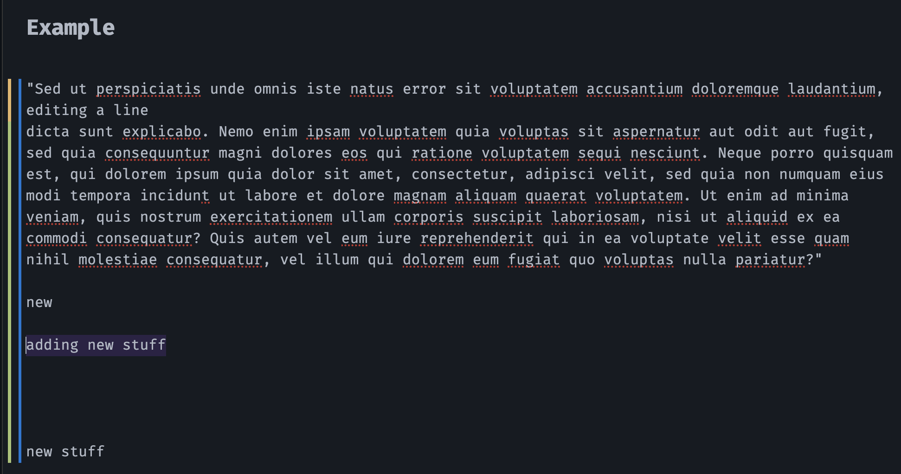

# Git Gutter for Obsidian

Git change indicators in the editor gutter — added, modified, and deleted lines.




## What it does

- Green bar for added lines
- Blue bar for modified lines
- Red triangle for deleted lines

Updates on save and when switching files.

## Requirements

Desktop only. Your vault needs to be in a git repo, and `git` needs to be on your PATH.

## Settings

- Colors for each change type
- Gutter width (1–6px)
- Auto-refresh on save (on/off)
- Periodic refresh interval (0 to disable)

## Install

**Manual:** clone into `.obsidian/plugins/`, run `npm install && npm run build`, enable in settings.

**From releases:** grab `main.js`, `manifest.json`, `styles.css` from the latest release, drop them in `.obsidian/plugins/git-gutter/`, enable.

## Dev

```bash
npm install
npm run dev    # watch mode
npm run build  # production build
```
